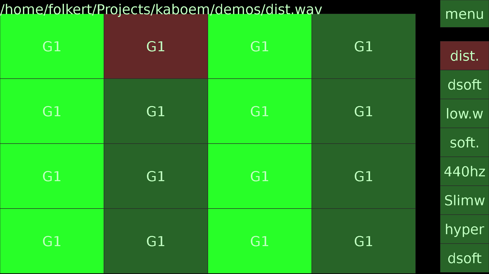
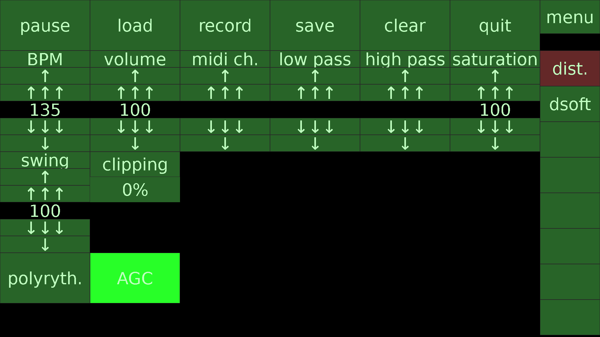
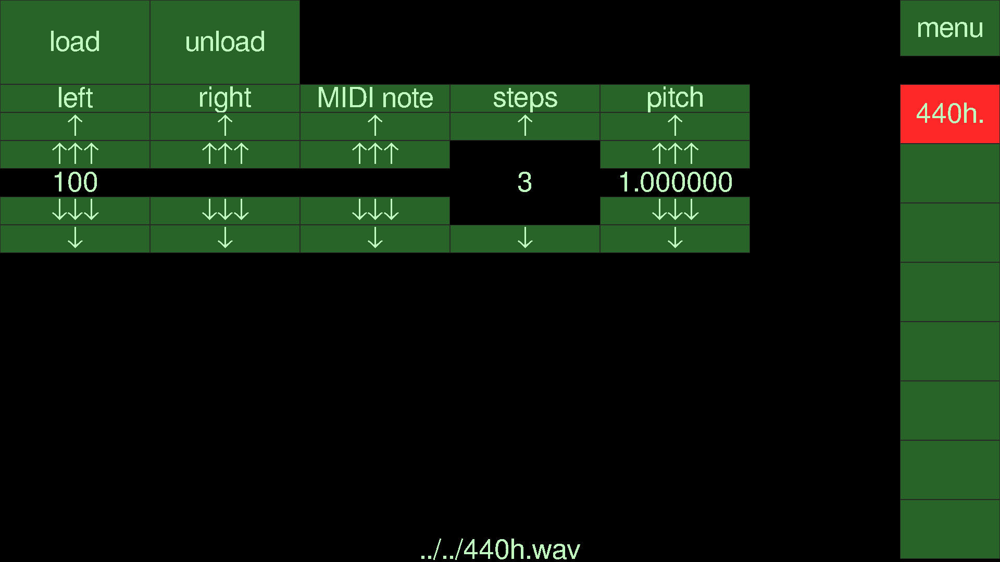

Kaboem is a pipewire and midi enabled audio-sequencer.

It specifically targets a raspberry pi with a touchscreen altough other Linux systems will work as well.

To be able to compile and run this program, you need to install:

```
sudo apt install libpipewire-0.3-dev libsdl3-dev libsdl3-ttf-dev libsndfile1-dev nlohmann-json3-dev libfftw3-dev build-essential cmake libfontconfig1-dev fonts-freefont-ttf

```

fonts-freefont-ttf: /usr/share/fonts/truetype/freefont/FreeSans.ttf

Because of the SDL3 requirement, this program requires at least Debian Trixie (13), Ubuntu Plucky (25.04) or equivalent (or more recent of course).

To compile:
```
mkdir build
cd build
cmake ..
make
```
The executable will then named 'kaboem'.
When invoked, it runs in "full screen"-mode. To get it in a window, run it with the "-w" switch.

Please note that this software is not even an alpha version. Work in progress!

The main screen shows 16 steps. In the settings-menu this can be changed to 3 upto 32 steps. The red square in the pattern-block is the cursor.
Each step contains the loudest frequency of the sample of that channel. Using the scroll wheel you can change the note/pitch played at that step. By pressing long (> 0.5 seconds) on a cell you get a context-menu for that cell.
On the right you see the 8 channels that you can select. At the top-right there's the button to switch between settings and edit mode.



Pressing "record" will record to a .wav-file.
Load/save are for writing the current song to a .kaboem-file for later re-edit.
In the settings-menu, click on a channel will open a channel-edit menu.
'AGC' is auto-gain-control, this will automatically reduce the volume of the audio to prevent clipping.
Pressing menu again will bring you back to the pattern-editor.



In the channel-edit menu, load/unload are for loading a sample in the channel.
Pressing the menu-button again brings you back the main-settings screen.



This software was written by Folkert van Heusden. License: MIT.
