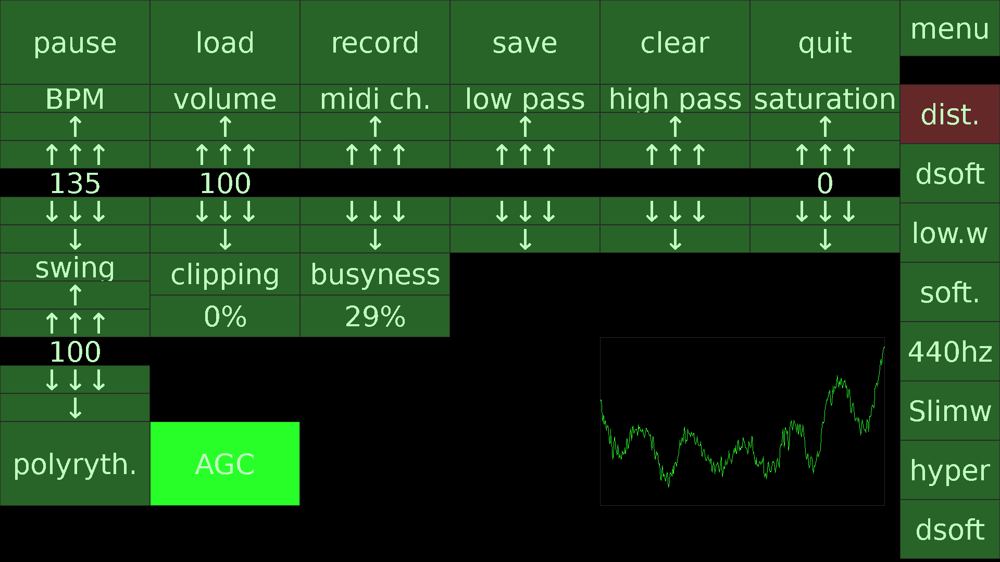

This software was written by Folkert van Heusden. License: MIT.

It specifically targets a raspberry pi with a touchscreen altough other Linux systems will work as well.

dim_cowbell_single_shot_studio_euf.wav, small-reverb-bass-drum-sound-a-key-10-G8d.wav and studio-hihat-sound-a-key-05-yvg.wav came from https://soundcamp.org/ where they were advertised as royalty free (2025/06/21). f-175-hardcore-kick-97252.wav is from https://pixabay.com/sound-effects/search/hardcore-kick/

To be able to compile and run this program, you need to install:

sudo apt install fonts-freefont-ttf libpipewire-0.3-dev libsdl3-dev libsdl3-ttf-dev libsndfile1-dev nlohmann-json3-dev

Note that this requires at least Debian Trixie (13), Ubuntu Plucky (25.04) or equivalent (because of SDL3).

To compile:
* mkdir build
* cd build
* cmake ..
* make

Please note that this software is not even an alpha version. Work in progress!

Preview:

